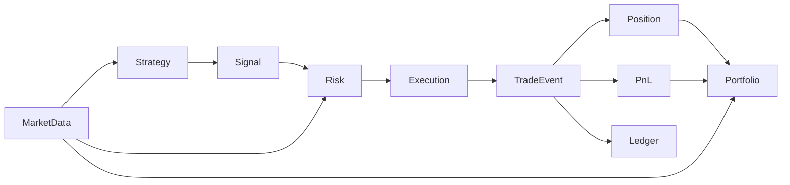
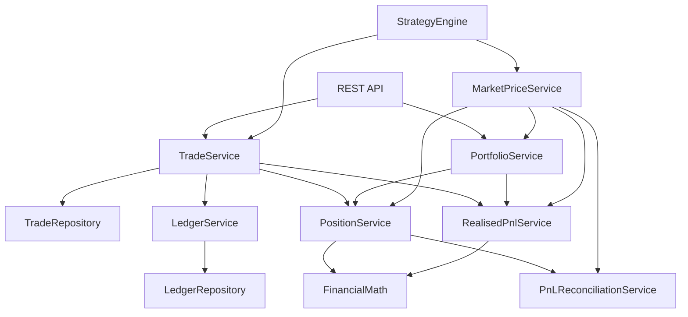
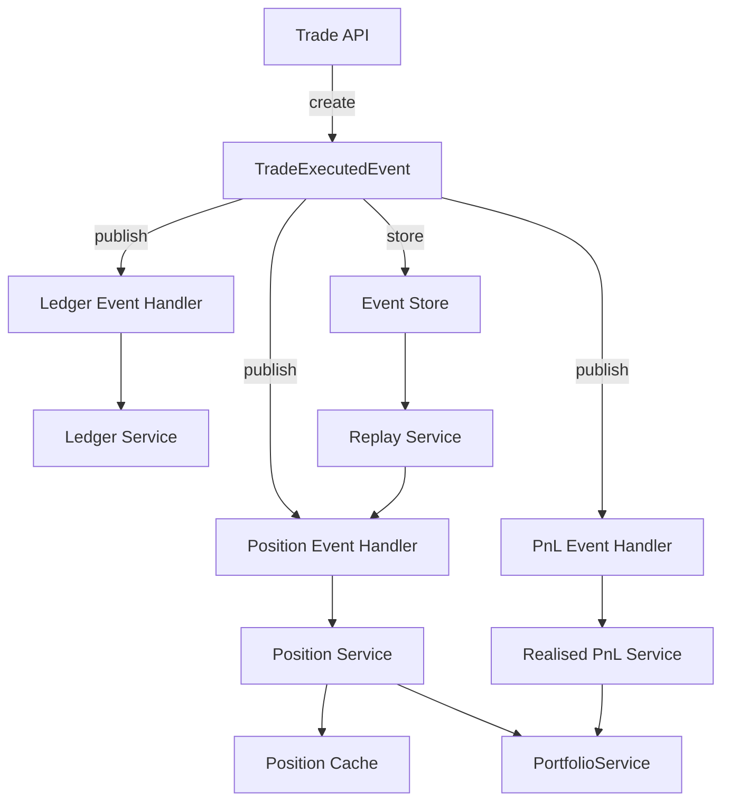

# Trading Risk Engine

A backend engine for deterministic trade processing, PnL accounting, portfolio analytics and audit logging.  
Designed as a core component for algorithmic trading systems, investment platforms, and arbitrage engines.


## Development Updates

Development progress and architecture notes are published here:
Telegram: https://t.me/denzo_rebuild

## Features

- **Deterministic trade processing** – order‑invariant results via fixed sort (`ORDER BY id`)
- **Realised / unrealised PnL** – average cost accounting model
- **Financial math layer** – centralised rounding, 8‑digit precision
- **PnL reconciliation** – audit‑grade consistency check (`realised + unrealised = total`)
- **Full audit trail** – immutable Ledger with event sourcing
- **Portfolio aggregation** – consolidated view of all positions, total PnL and exposure
- **Market price abstraction** – pluggable price source (in‑memory implementation included)
- **Strategy interface** – extensible for algorithmic trading

## Tech Stack

- Java 21
- Spring Boot 3.5
- PostgreSQL 16
- JPA / Hibernate
- Maven
- Docker

## Architecture


UPD

Detailed architecture documentation:
docs/architecture/system-overview.md

## Architecture Decisions

Key architectural choices are documented using ADR.

See:

docs/adr/

Examples:

- deterministic trade processing
- event-driven trade pipeline
- unified live/backtest execution
- modular risk engine

## Engineering Principles

- **Deterministic processing** – trades always processed in fixed order (`ORDER BY id`) to ensure reproducible results.
- **Financial precision** – all arithmetic routed through `FinancialMath`, guaranteeing uniform rounding and scale.
- **Auditability** – every state change recorded in immutable `Ledger`, enabling full traceability.
- **Layered architecture** – clear separation between API, domain, services, and persistence.

## Core Components

The engine consists of several core subsystems:

- Trade Engine — deterministic trade processing
- Position Engine — trade aggregation and average price
- PnL Engine — realised and unrealised PnL
- Ledger — immutable accounting log
- Portfolio Engine — portfolio aggregation
- Risk Engine — pre-trade validation
- Strategy Engine — signal generation
- Backtesting Engine — deterministic historical replay

## Deterministic Execution

The engine guarantees deterministic trade processing.

This means that identical trade sequences always produce identical results.

To guarantee determinism the system enforces:

- fixed trade ordering (`ORDER BY id`)
- centralized financial rounding
- immutable ledger
- event replay capability

Determinism is critical for:

- financial audit
- backtesting reliability
- reproducible simulations

## API

### Trades

- `POST /trades` – execute a trade (body: `CreateTradeRequest`)

### Positions

- `GET /positions/{symbol}` – current position

### PnL Reconciliation

- `GET /positions/{symbol}/reconcile` – verify accounting identity

### Ledger

- `GET /ledger` – all entries
- `GET /ledger/{symbol}` – history for symbol

### Portfolio

- `GET /portfolio` – aggregated portfolio view

## Example Workflow

1. **Execute trades**  
   `BUY 2 BTC @60000`  
   `BUY 1 BTC @61000`  
   `SELL 1.5 BTC @63000`

2. **Position engine**  
   `quantity = 1.5`  
   `average price = 60333.33333333`

3. **Realised PnL**  
   `(63000 - 60333.33333333) * 1.5 = 4000.00000001`

4. **Unrealised PnL** (with current price 63500)  
   `(63500 - 60333.33333333) * 1.5 = 4750.00000001`

5. **Reconciliation**  
   `realised + unrealised = 8750.00000002`  
   `total = revenue + current value - cost` → matches.

6. **Ledger** records all steps.

## Running Locally

**Requirements:**

- Java 21
- Docker
- PostgreSQL (via Docker)

```bash
# Start PostgreSQL
docker compose up -d

# Run application
./mvnw spring-boot:run
```
Application will be available at `http://localhost:8080`.

## Future Improvements

- Advanced risk controls (drawdown limits, volatility filters)
- Execution slippage modelling
- Real-time market data ingestion
- Multi-asset portfolio support
- High-load optimisation (caching, partitioning)

## Documentation

Additional project documentation:
- Architecture overview: `docs/architecture/system-overview.md`
- Architecture decisions: `docs/adr/`
- Configuration reference: `docs/operations/configuration.md`
- Monthly development snapshots: `docs/Monthly_Snapshots.txt`

## License

MIT